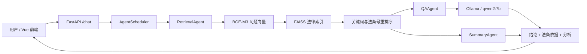

# 基于本地大语言模型的法律法规智能问答系统

本项目是一个面向法律法规知识查询场景的本地智能问答原型。系统通过 Ollama 运行本地大语言模型，使用 BGE-M3 生成法律条文向量、FAISS 建立向量索引，并通过 RAG（Retrieval-Augmented Generation，检索增强生成）将相关法条作为证据交给模型生成回答。

在基础 RAG 能力之上，项目实现了 RetrievalAgent、QAAgent、SummaryAgent 和 AgentScheduler，支持多轮问答、问题改写、法条引用、证据摘要、低置信度提示和调度过程展示，并提供 FastAPI 接口与 Vue 可视化前端。

> 本系统用于课程实践、技术研究和法律知识辅助检索，不构成正式法律意见。具体案件应结合完整事实并咨询专业法律人士。

## 一、项目成果

项目包含以下三类核心成果：

1. **本地模型问答系统原型**
   - Ollama 本地运行 `qwen2:7b`
   - FastAPI 后端接口
   - Vue 3 + TypeScript 可视化前端
   - 支持多轮对话、RAG 开关、法条检索和引用展示

2. **法律数据、向量索引与 RAG 系统**
   - 法律网页解析与原始 JSON 数据
   - 法律条文清洗与统一结构化
   - 2,602 条清洗后法律条文
   - BGE-M3 中文向量化
   - FAISS 向量索引与元数据
   - 检索、重排序、证据约束生成和引用返回

3. **多 Agent 调度与系统演示**
   - RetrievalAgent：检索法律条文
   - QAAgent：基于证据生成回答
   - SummaryAgent：整理法条证据
   - AgentScheduler：统一组织执行顺序和异常处理
   - 前端显示引用证据、置信状态和 Agent 处理步骤

## 二、系统架构



完整数据链路：

```text
法律网页/HTML
    ↓ crawler/pkulaw_crawler.py
data/raw/*.json
    ↓ cleaner/clean_articles.py
data/clean/cleaned_articles.json
    ↓ embedding/build_index.py + BGE-M3
data/index/law_index.faiss
data/index/law_metadata.json
    ↓ embedding/search.py
相关法律条文
    ↓ RAG 提示词 + qwen2:7b
带结论、依据和引用的法律回答
```

## 三、主要技术栈

| 模块 | 技术 |
|---|---|
| 本地模型运行 | Ollama |
| 对话生成模型 | qwen2:7b |
| 向量模型 | bge-m3 |
| 向量数据库 | FAISS（IndexFlatIP） |
| 后端 | Python、FastAPI、Pydantic、Uvicorn |
| Agent | 自定义 AgentScheduler、LangChain Tool 适配 |
| 前端 | Vue 3、TypeScript、Vite、Axios |
| 数据格式 | JSON |
| 自动化测试 | unittest |

## 四、项目目录

```text
legal-qa-system/
├── agent/                         # 多 Agent 实现
│   ├── retrieval_agent.py         # 法条检索 Agent
│   ├── qa_agent.py                # 法律问答 Agent
│   ├── summary_agent.py           # 证据总结 Agent
│   ├── scheduler.py               # Agent 调度器
│   └── langchain_tools.py         # LangChain Tool 适配
├── api/
│   ├── main.py                    # FastAPI 路由与 RAG 核心流程
│   └── config.py                  # 对话模型与服务配置
├── crawler/
│   ├── pkulaw_crawler.py          # 法律网页/HTML 解析程序
│   └── lawhtml/                   # 保存的法律网页文件
├── cleaner/
│   └── clean_articles.py          # 法律条文清洗程序
├── embedding/
│   ├── build_index.py             # 构建 FAISS 索引
│   ├── search.py                  # 向量检索与法律规则重排序
│   └── config.py                  # 向量模型和数据路径配置
├── data/
│   ├── raw/                       # 爬取后的原始法律 JSON
│   ├── clean/
│   │   └── cleaned_articles.json  # 统一清洗后的 2,602 条法条
│   ├── index/
│   │   ├── law_index.faiss        # FAISS 向量索引
│   │   └── law_metadata.json      # 法条元数据
│   └── test/                      # 100 题测试集和重点回归结果
├── frontend/                      # Vue 可视化前端
│   ├── src/App.vue
│   ├── src/api.ts
│   ├── src/style.css
│   └── vite.config.ts
├── services/                      # 会话存储服务
├── tests/                         # 后端与 Agent 单元测试
├── run_agent_batch_test.py        # Agent 批量测试
├── run_chat_regression_test.py    # 重点问题回归测试
├── run_live_demo.py               # 终端演示脚本
├── requirements.txt               # Python 依赖
└── README.md
```

## 五、环境要求

推荐环境：

- Windows 10/11
- Python 3.10 或更高版本
- Node.js 18 或更高版本
- npm
- Ollama
- 至少能够运行 `qwen2:7b` 的内存或显存空间

检查环境：

```powershell
python --version
node --version
npm --version
ollama --version
```

## 六、首次安装

### 1. 克隆项目

```powershell
git clone https://github.com/tree711/legal-qa-system.git
cd legal-qa-system
```

### 2. 创建 Python 虚拟环境

建议为本项目单独创建虚拟环境，不与其他 Python 项目共用。

```powershell
python -m venv .venv
```

PowerShell 激活：

```powershell
.\.venv\Scripts\Activate.ps1
```

如果 PowerShell 阻止脚本执行，可只对当前终端临时放行：

```powershell
Set-ExecutionPolicy -Scope Process -ExecutionPolicy Bypass
.\.venv\Scripts\Activate.ps1
```

CMD 激活：

```bat
.venv\Scripts\activate.bat
```

安装 Python 依赖：

```powershell
python -m pip install --upgrade pip
python -m pip install -r requirements.txt
```

### 3. 安装并准备 Ollama 模型

确保 Ollama 服务已经启动，然后拉取对话模型和向量模型：

```powershell
ollama pull qwen2:7b
ollama pull bge-m3
```

检查模型：

```powershell
ollama list
```

默认配置：

| 用途 | 模型/地址 |
|---|---|
| 对话模型 | `qwen2:7b` |
| 向量模型 | `bge-m3` |
| Ollama 地址 | `http://127.0.0.1:11434` |
| FastAPI 端口 | `8000` |
| Vite 前端端口 | `5173` |

配置文件位于 `api/config.py` 和 `embedding/config.py`。

### 4. 安装前端依赖

```powershell
cd frontend
npm install
cd ..
```

如果依赖锁文件与环境完全一致，也可以使用：

```powershell
cd frontend
npm ci
cd ..
```

若 Windows PowerShell 对 `npm` 命令解析异常，可使用 `npm.cmd`：

```powershell
npm.cmd install
```

## 七、法律数据处理与索引构建

仓库已经提供清洗数据和 FAISS 索引，一般可以直接启动系统。需要重新处理数据或更换向量模型时，按以下流程执行。

### 1. 解析法律 HTML

```powershell
python crawler/pkulaw_crawler.py --html-file crawler/lawhtml/labor_contract_law_pkulaw.html --output data/raw/labor_contract_law.json
```

爬虫/解析模块会将法律名称、条号、章节和正文整理为原始 JSON。使用网络数据时，应遵守目标网站的使用条款、robots 规则及相关法律规定；本项目保留的 HTML 主要用于课程研究和离线解析。

### 2. 清洗法律条文

```powershell
python cleaner/clean_articles.py
```

清洗过程包括：

- 统一空格、换行和标点；
- 去除网页残留信息；
- 去除正文中重复条号；
- 统一法律名称、章节、条号和来源字段；
- 为每条法律条文生成唯一 ID。

输出文件：

```text
data/clean/cleaned_articles.json
```

### 3. 构建 FAISS 索引

确认 Ollama 已运行且 `bge-m3` 已安装：

```powershell
python embedding/build_index.py
```

输出文件：

```text
data/index/law_index.faiss
data/index/law_metadata.json
```

注意：更换 embedding 模型后必须重新构建索引，不同模型的向量维度和语义空间不能混用。

### 4. 单独测试法条检索

```powershell
python embedding/search.py "六个月劳动合同可以约定两个月试用期吗？"
```

或在代码中调用：

```python
from embedding.search import search

results = search("劳动合同未签订书面合同怎么办？", top_k=5)
```

检索模块先从 FAISS 获取候选法条，再针对决定性关键词和法条号进行重排序。例如：

- “合同成立”优先识别《民法典》第四百八十三条；
- “未签书面劳动合同”优先识别《劳动合同法》第十条、第八十二条；
- “拖欠工资解除合同”优先识别《劳动合同法》第三十八条等相关条款。

## 八、启动系统

系统需要同时运行 Ollama、FastAPI 后端和 Vue 前端。建议分别使用三个终端。

### 终端一：确认 Ollama 已启动

```powershell
ollama list
```

### 终端二：启动后端

在项目根目录执行：

```powershell
.\.venv\Scripts\Activate.ps1
uvicorn api.main:app --host 127.0.0.1 --port 8000
```

访问：

- API 文档：<http://127.0.0.1:8000/docs>
- ReDoc 文档：<http://127.0.0.1:8000/redoc>
- 健康检查：<http://127.0.0.1:8000/health>

直接访问 `http://127.0.0.1:8000/` 返回 404 属于正常现象，因为后端没有定义根路径页面。

### 终端三：启动前端

```powershell
cd frontend
npm.cmd run dev
```

访问：

<http://127.0.0.1:5173>

前后端在同一台电脑运行时，Vite 默认将 `/api` 代理到 `http://127.0.0.1:8000`，不需要连接手机热点。

## 九、局域网跨设备演示

如果前端运行在另一台电脑，或需要同学通过局域网访问后端：

1. 两台电脑连接同一 Wi-Fi 或手机热点；
2. 后端监听所有网卡：

```powershell
uvicorn api.main:app --host 0.0.0.0 --port 8000
```

3. 在后端电脑运行 `ipconfig`，找到当前局域网 IPv4 地址；
4. 将 `frontend/.env.example` 复制为 `frontend/.env`；
5. 修改代理地址，例如：

```env
VITE_PROXY_TARGET=http://172.20.10.2:8000
```

6. 重新启动 Vite；
7. 如仍无法访问，检查 Windows 防火墙是否允许 Python/Uvicorn 使用 8000 端口。

局域网 IP 可能在重新连接网络后改变，因此本机开发应优先使用 `127.0.0.1`。

## 十、API 接口

### 接口一览

| 方法 | 路径 | 作用 |
|---|---|---|
| GET | `/health` | 检查 API、Ollama、模型和索引状态 |
| POST | `/generate` | 只调用本地模型，不检索法律条文 |
| POST | `/search` | 只检索相关法条，不生成回答 |
| POST | `/rag` | 单轮检索增强问答 |
| POST | `/chat` | 多轮对话与三 Agent 统一入口 |
| POST/GET | `/sessions` | 创建和查询会话 |
| GET/DELETE | `/sessions/{session_id}` | 查询或删除指定会话 |
| POST | `/sessions/{session_id}/clear` | 清空指定会话 |
| GET | `/stats` | 获取知识库和服务统计信息 |

### `/search` 示例

请求：

```json
{
  "query": "六个月劳动合同可以约定两个月试用期吗？",
  "top_k": 5
}
```

响应包含法律名称、条号、正文、章节、来源和相关度分数。

### `/rag` 示例

```json
{
  "prompt": "六个月劳动合同可以约定两个月试用期吗？",
  "top_k": 5
}
```

该接口完成一次“检索—提示词构建—模型生成—引用返回”。

### `/chat` 示例

```json
{
  "messages": [
    {
      "role": "user",
      "content": "劳动合同必须采用书面形式吗？"
    },
    {
      "role": "assistant",
      "content": "原则上应当订立书面劳动合同。"
    },
    {
      "role": "user",
      "content": "如果公司一直没签怎么办？"
    }
  ],
  "top_k": 5,
  "use_rag": true
}
```

`use_rag=false` 时，系统跳过法条检索，不返回法律引用，并在处理步骤中标明 RAG 已关闭。

## 十一、RAG 生成约束

为减少“检索到正确法条但模型仍然答错”的情况，系统在生成阶段采用以下约束：

1. 只能依据当前检索结果中的法律条文回答；
2. 必须先给明确结论，再列法律依据和解释；
3. 未检索到决定性依据时，应明确说明依据不足；
4. 不得引用检索结果中不存在的法条或链接；
5. 不得把例外规则错误套用到一般情形；
6. 引用编号必须能够对应前端展示的证据。

该约束与检索重排序共同降低法律结论错误、无依据扩写和虚构引用。

## 十二、多 Agent 调度

### RetrievalAgent

负责接收问题、调用检索模块并标准化法律条文结果。出现检索失败、超时或空结果时返回结构化错误，供调度器决定后续流程。

### QAAgent

负责根据检索证据调用本地模型，生成最终法律回答。支持单轮问答和多轮消息历史。

### SummaryAgent

负责对检索结果进行结构化整理，生成便于前端展示和人工复核的证据摘要。

### AgentScheduler

统一调度三个 Agent：

```text
接收用户问题与历史
→ 提取或改写当前问题
→ RetrievalAgent 检索
→ QAAgent 基于同一批证据生成答案
→ SummaryAgent 整理证据
→ 返回答案、引用、摘要、置信状态和执行步骤
```

首轮和多轮问答均通过 `/chat` 进入统一调度流程。检索结果由 QAAgent、SummaryAgent 和前端复用，避免重复检索造成回答与引用不一致。

## 十三、前端功能

可视化前端采用黑白简约的法律主题设计，主要功能包括：

- 多轮法律问答；
- 新建、切换、删除和清空对话；
- 浏览器本地保存会话记录；
- 开启或关闭 RAG；
- 选择 Top-K 证据数量；
- 独立法条证据检索；
- 展示法条名称、条号、正文、来源和匹配度；
- 展示 Agent 调度步骤和证据摘要；
- 低置信度提示；
- 复制回答、追问依据和导出对话；
- 后端服务连接状态显示；
- 桌面端与移动端响应式布局。

## 十四、测试与评价

### 1. 单元测试

在项目根目录、虚拟环境激活状态下运行：

```powershell
python -m unittest tests.test_agents tests.test_chat_pipeline tests.test_generation_constraints tests.test_legal_rerank
```

测试范围包括：

- RetrievalAgent、QAAgent、SummaryAgent 的基本行为；
- `/chat` 统一调度流程；
- 关闭 RAG 时是否真正跳过检索；
- 模型生成约束；
- 决定性法条关键词重排序。

### 2. 重点回归测试

先启动 Ollama 和 FastAPI，再执行：

```powershell
python run_chat_regression_test.py
```

回归题覆盖试用期、未签书面劳动合同、拖欠工资、合同成立、未成年人交易、网络订单、共同犯罪以及多轮追问等易错问题。

重点回归结果：

```text
data/test/chat_regression_results_v3.json
```

### 3. 100 条测试数据集

项目保留两组完整的 100 条测试结果，用于比较基础 RAG 流程与完整 Agent 流程：

```text
data/test/test_samples_full.json               # 基础 RAG 测试结果
data/test/test_samples_full_agent_result.json  # 完整 Agent 调度测试结果
```

两组数据使用相同的问题范围和统一字段，可以分别复核检索与生成效果，并观察引入 Agent 调度后的结果变化。主要字段包括：

```json
{
  "question": "测试问题",
  "expected_answer": "预期答案",
  "retrieved_text": "检索到的法律条文",
  "model_output": "系统实际回答",
  "evaluation_note": "测试记录或人工评价"
}
```

评价时建议分别检查：

- 最终结论是否正确；
- 是否命中决定性法条；
- 回答是否只依据检索证据；
- 引用是否真实且与答案一致；
- 多轮追问是否保留前文对象和事实；
- 关闭 RAG 时是否不再展示引用；
- 系统响应是否成功、稳定且可复现。

## 十五、推荐演示流程

答辩或课程展示时可按以下顺序进行：

1. 打开 `http://127.0.0.1:8000/docs`，展示后端接口；
2. 调用 `/health`，证明本地模型和 FAISS 索引可用；
3. 调用 `/search`，展示纯法条检索；
4. 打开 `http://127.0.0.1:5173`，展示可视化系统；
5. 提问“公司与员工签订六个月劳动合同，却约定两个月试用期，是否合法？”；
6. 展示结论、《劳动合同法》第十九条和右侧证据栏；
7. 进行“劳动合同必须签书面的吗？”→“如果公司一直没签怎么办？”多轮测试；
8. 关闭 RAG 后再次提问，展示无引用模式；
9. 进入法条检索页面，展示 Top-K、匹配度和法条正文；
10. 展示 Agent 处理步骤、测试数据集及回归结果。

## 十六、常见问题

### 1. 访问后端根地址显示 404

这是正常现象。请访问：

```text
http://127.0.0.1:8000/docs
```

### 2. 前端显示无法连接后端

确认：

- Uvicorn 正在 8000 端口运行；
- `http://127.0.0.1:8000/health` 返回成功；
- 修改 Vite 代理后已经重启前端；
- 本机运行时没有继续使用旧的热点 IP。

### 3. `vite` 不是内部或外部命令

说明前端依赖没有安装成功。进入 `frontend` 后执行：

```powershell
npm.cmd install
npm.cmd run dev
```

### 4. 模型调用失败

执行：

```powershell
ollama list
ollama pull qwen2:7b
ollama pull bge-m3
```

并确认 Ollama 后台服务正在运行。

### 5. FAISS 索引不存在或模型维度不一致

重新执行：

```powershell
python embedding/build_index.py
```

不要使用其他 embedding 模型生成的旧索引。

### 6. VS Code 选择了错误的 Python

选择项目解释器：

```text
项目目录\.venv\Scripts\python.exe
```

也可以在 VS Code 命令面板中使用 `Python: Select Interpreter` 重新选择。

## 十七、能力边界与后续方向

当前版本已经完成课程原型所需的本地模型、法律数据、向量检索、RAG、多 Agent 和可视化界面。后续可进一步扩展：

- 增加更多现行法律法规和司法解释；
- 引入交叉编码器或专用法律模型进行二阶段重排；
- 增加流式输出和请求取消；
- 使用数据库持久化用户会话；
- 增加测试指标统计与可视化评价页面；
- 增强法律版本、效力层级和时效性管理；
- 增加用户权限、访问频率限制和日志脱敏；
- 对引用来源进行在线校验或建立本地权威版本库。

## 十八、项目说明

本项目采用分支协作开发：

- `feature/crawler`：法律网页解析与原始数据；
- `feature/cleaner`：法律数据清洗与测试数据；
- `feature/embedding`：向量索引、RAG、API、Agent、前端及系统整合；
- `master`：最终稳定版本。

合并时应保留各模块源码、清洗数据、索引文件、测试集和说明文档，并避免提交 `.venv`、`node_modules`、`.env` 等本地环境文件。
