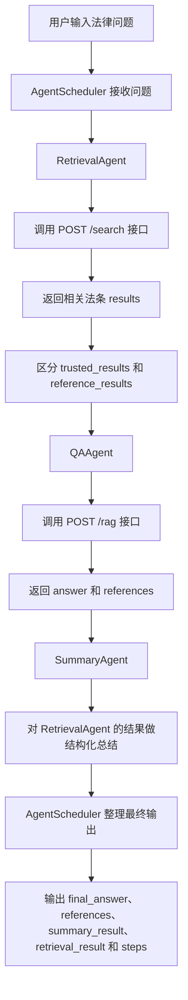
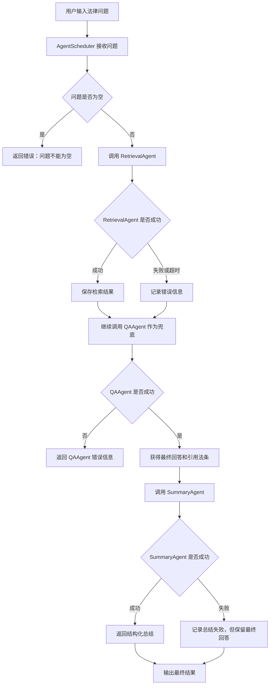

# AgentScheduler 调度流程图

## 1. 当前版本说明

当前版本已经接入三个 Agent：

1. `RetrievalAgent`：调用 `/search` 接口，检索相关法条
2. `QAAgent`：调用 `/rag` 接口，生成最终法律问答结果
3. `SummaryAgent`：对检索到的法条做结构化总结

三个 Agent 不是同时运行，而是由 `AgentScheduler` 按顺序调度。

当前完整流程为：

用户问题 -> RetrievalAgent -> QAAgent -> SummaryAgent -> 最终输出

---

## 2. 三个 Agent 调度流程图



---

## 3. Day 4 异常处理流程图



---

## 4. 三个 Agent 的职责

### RetrievalAgent

负责检索相关法条。

调用方式：

```python
retrieval_result = RetrievalAgent().retrieve(question)
```

主要返回字段：

```text
status
results
trusted_results
reference_results
message
```

### QAAgent

负责生成最终法律问答结果。

调用方式：

```python
qa_result = QAAgent().answer(question)
```

主要返回字段：

```text
success
answer
references
raw
```

### SummaryAgent

负责对检索结果做结构化总结。

调用方式：

```python
summary_result = SummaryAgent().summarize(retrieval_result)
```

主要返回字段：

```text
status
summary
references
message
```

---

## 5. Day 4 更新内容

Day 4 对调度器进行了以下完善：

1. 增加空问题检查
2. 增加 RetrievalAgent 超时后的兜底处理
3. RetrievalAgent 调用失败时，继续调用 QAAgent
4. QAAgent 失败时返回明确错误信息
5. SummaryAgent 失败时不影响最终回答
6. 输出完整 steps，方便联调和测试